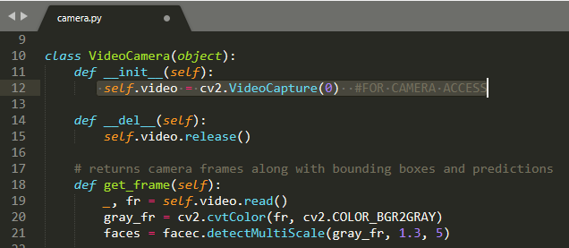
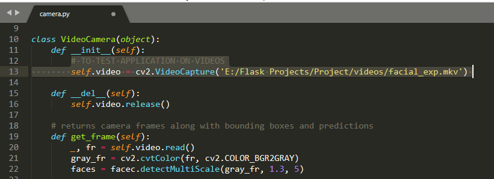

# Emotion-Recognition
It is a Emotion Recognition Application executed using Flask. Emotions such as Happy, Sad, Surprised, Angry, etc. are detected using an emotion detection deep learning model.

The emotion recognition system can be tested in 2 ways: 
1. By running a previously uploaded videos. 

2. The user can also give camera access to the application to check the real time model performance.

